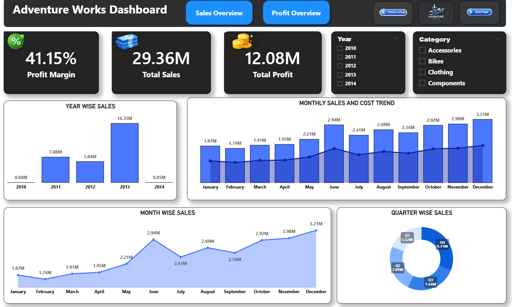
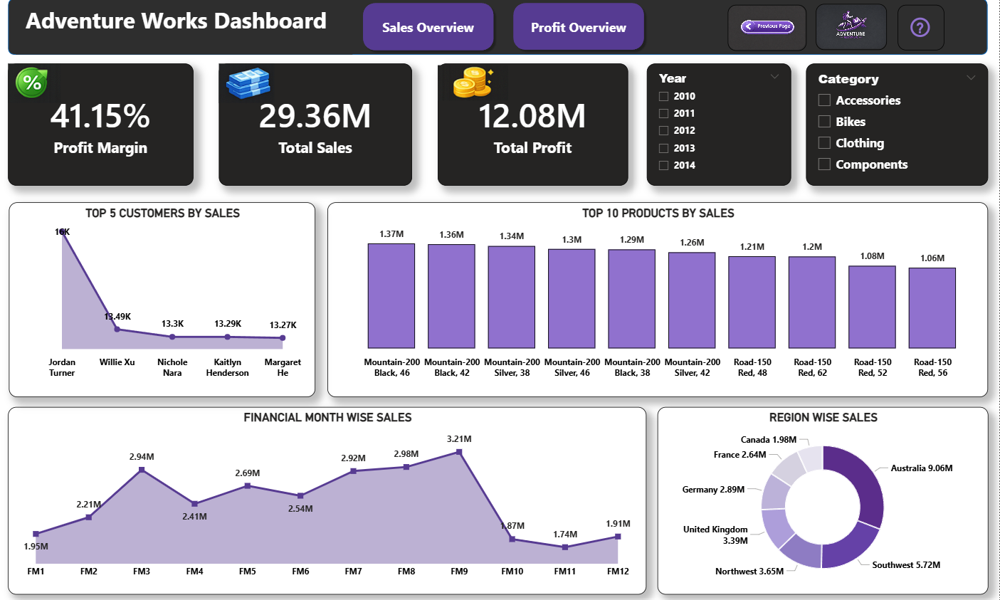
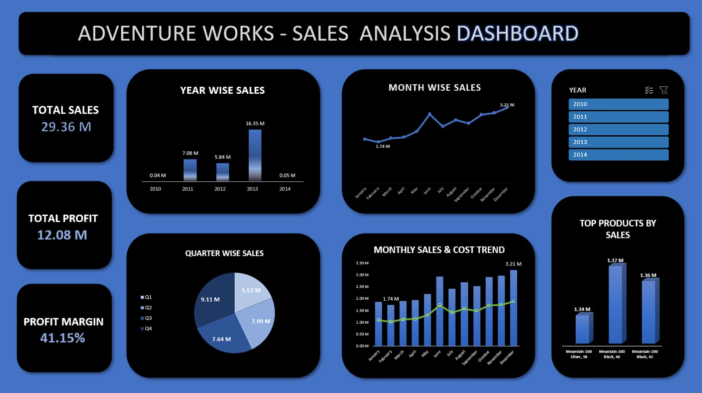
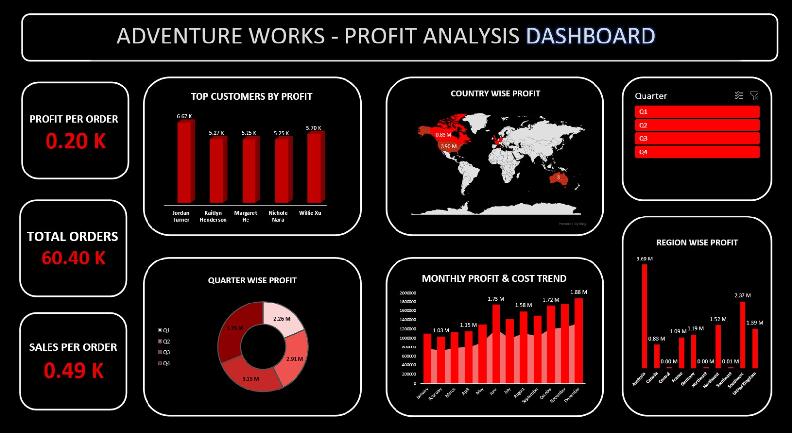
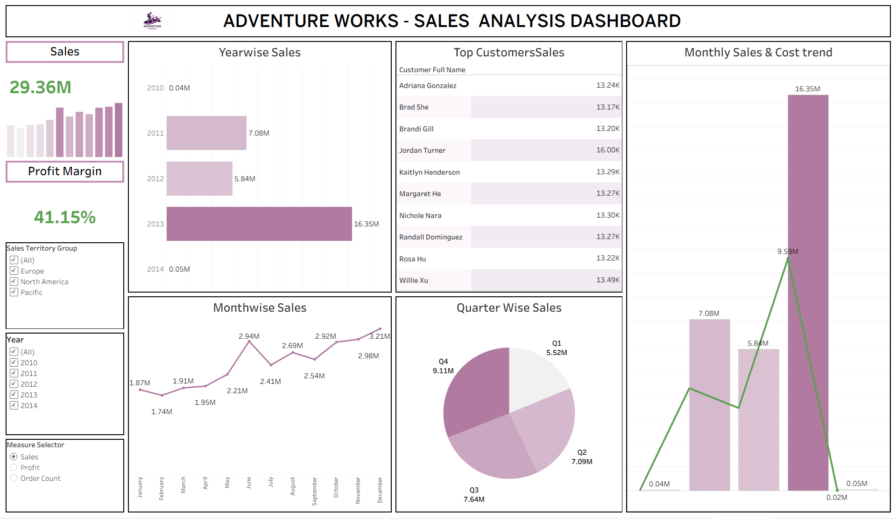
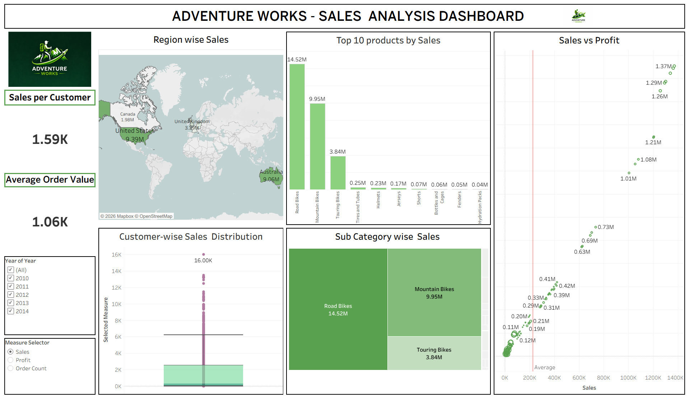

# Adventure Works Business Intelligence Project

## Project Overview
This project analyzes the **Adventure Works sales dataset** to identify key business insights such as product performance, customer trends, and regional sales distribution.  
The analysis was performed using multiple Business Intelligence tools to demonstrate data cleaning, querying, visualization, and dashboard development.

## Tools Used
- Excel
- SQL
- Power BI
- Tableau

## Project Structure
Adventure-Works-BI-Project
│
├── Excel-Dashboard
├── SQL-Analysis
├── PowerBI-Dashboard
├── Tableau-Dashboard
├── Images
└── README.md

## Excel Dashboard
The Excel module focuses on initial data exploration and visualization.

Key tasks:
- Data cleaning and preparation
- Pivot tables and charts
- Month-wise and quarter-wise sales analysis

## SQL Analysis
SQL was used to extract and analyze data from the Adventure Works dataset.

Key tasks:
- Creating relational queries
- Using joins and aggregations
- Analyzing product, customer, and region-wise sales

## Power BI Dashboard
An interactive dashboard created using Power BI.

Features:
- KPIs: Total Sales, Profit, Profit Margin
- Interactive slicers
- Drill-through analysis
- Power Query data transformation
- DAX measures

## Tableau Dashboard
Tableau was used to build visual dashboards for advanced analysis.

Features:
- Product performance analysis
- Customer trends
- Regional sales insights
- Time-based filters and calculated fields

## Dashboard Preview

### Power BI Dashboards

### Excel Dashboards

### Tableau Dashboards

### SQL Analysis Results

## Author
Harsha Vardhan Raju Karapa  
Aspiring Data Analyst
